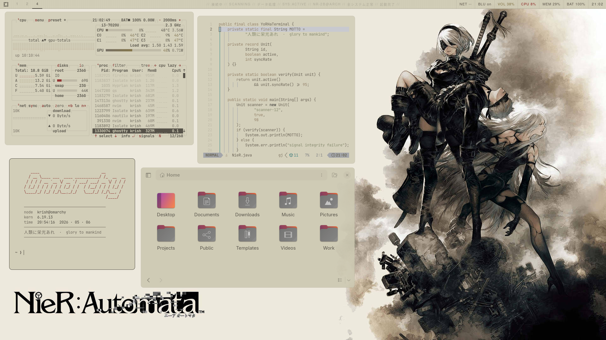

# NieR-Light — Omarchy Theme

A light theme for [Omarchy](https://omarchy.org) inspired from NieR: Automata. Clean parchment tones, ink typography, and subtle grid texture across all surfaces.



## Palette

| Role | Hex |
|---|---|
| Background | `#d1cdb7` |
| Ink / Text | `#454138` |
| Parchment | `#dcd8c0` |
| Mid tone | `#bab5a1` |
| Error / Critical | `#8b2020` |

## Features

- Waybar with grid texture background and YoRHa ink palette
- Hyprlock lockscreen
- Walker launcher with parchment grid background
- Full palette across ghostty, btop, neovim (Kanagawa Lotus), swayosd, gtk
- Fish shell and fzf colors

## Font

This theme uses `Nimbus Sans` (Helvetica substitute) for a clean android UI feel matching the original NieR interface. Falls back to any sans-serif if unavailable.

For monospace components, font follows your Omarchy font setting — change with `omarchy-font-set`.

## Terminal Greeting

A NieR-styled terminal greeting is included at `quickshell/nier-welcome.sh`. It displays an ASCII art header, system info, and the Sanskrit phrase `बलिदान परमो धर्म: · glory to mankind`.

**Fish shell only.** Add to `~/.config/fish/config.fish`:

```fish
if status is-interactive
    ~/.config/omarchy/current/theme/nier-welcome.sh
end
```

Requires `figlet` for the ASCII art header (`yay -S figlet`). Without it the greeting will fail silently.

## Credits

- [samyns/Unit-3](https://github.com/samyns/Unit-3) — Quickshell widgets, NieR UI components, and original rice this theme is based on
- [metakirby5/yorha](https://github.com/metakirby5/yorha) — Canonical NieR: Automata CSS design language and color palette

